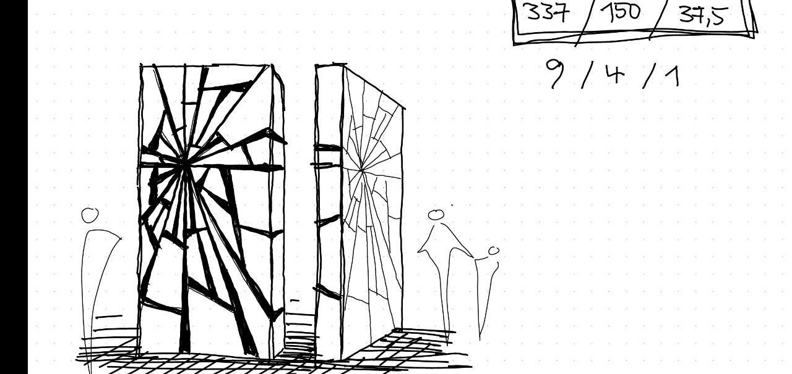
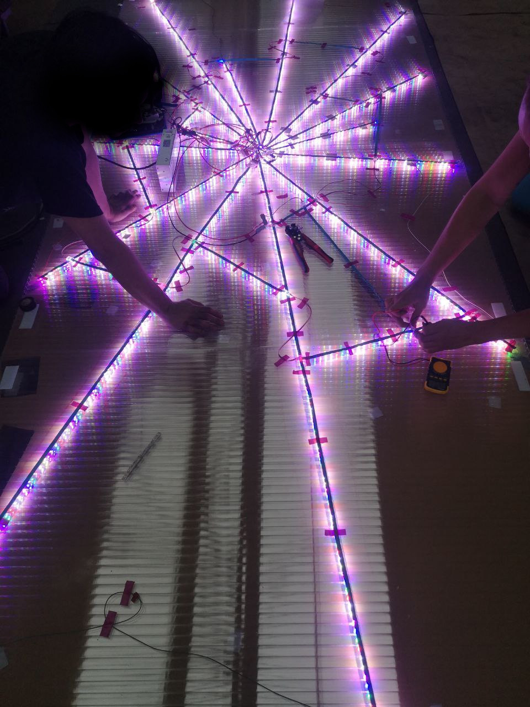
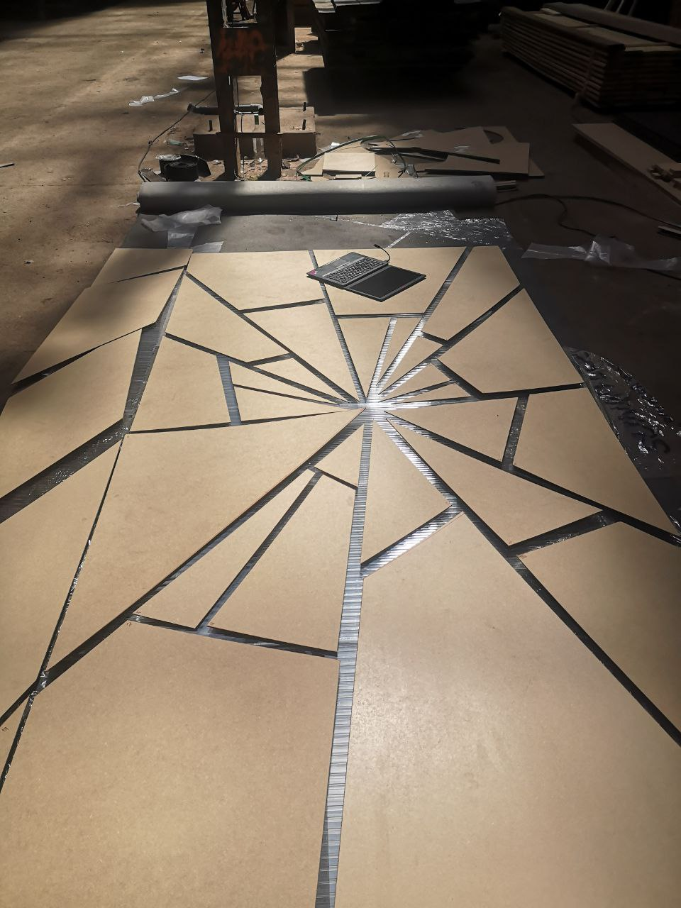
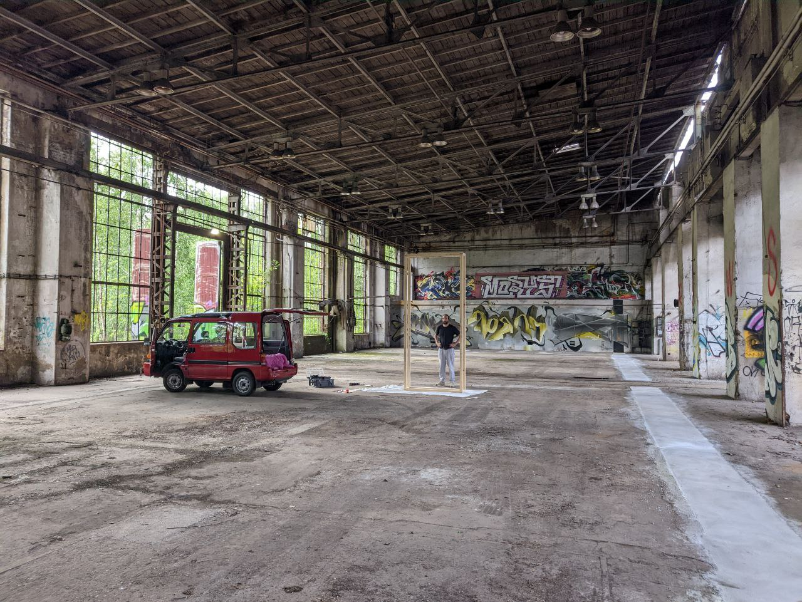

# (s|c)hatter



What happened:

1. Build the monolith with single addressable mapped LEDs


What should happen:

1. A webcam mounted under the ceiling
2. Object track a random visitor
3. Project an [anamorphic circle](https://en.wikipedia.org/wiki/Anamorphosis) on the surface of the monolith for this visitor


## Designs

- https://mega.nz/folder/VhFiTISY#yt0wFpmpHZuciwtbA6dg1w

## Stack

- Control ws2812b: [smart-leds](https://github.com/smart-leds-rs/smart-leds)
- [Nannou](https://github.com/nannou-org/nannou)

## Install

```bash
cargo install cross
# Nannou
sudo apt-get install curl build-essential python3 cmake pkg-config
sudo apt-get install libasound2-dev
sudo apt install libxcb-shape0-dev libxcb-xfixes0-dev
sudo apt-get install libvulkan1 mesa-vulkan-drivers vulkan-tools
```




